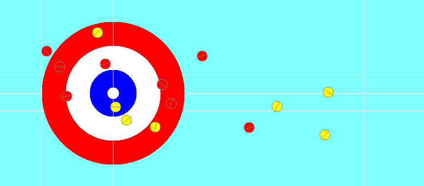

# Curling
Simulated curling environment  
  
Physics based on [Dynamics and curl ratio of a curling stone](https://rdcu.be/dgIW2)  
Used in [https://github.com/George-Ogden/betacurl](https://github.com/George-Ogden/betacurl)
## Install
With pip
```sh
pip install curling
```
from source
```sh
git clone https://github.com/George-Ogden/curling
pip install .
```
## Usage
```python
from curling import Curling, SimulationConstants, StoneColor, StoneThrow
import numpy as np

accurate_constants = SimulationConstants(time_intervals=.05)

# leave blank for a random starting stone
current_player = StoneColor.RED
curling = Curling(current_player)
curling.reset(starting_color=current_player) # optional for first game

for i in range(curling.num_stones_per_end):
    current_player = curling.next_stone_color
    # throw a stone
    curling.throw(
        StoneThrow(
            color=current_player,
            # sqrt velocity is specified
            sqrt_velocity=np.random.uniform(1.35, 1.46),
            angle=np.random.uniform(-.06, .05),
            spin=np.random.uniform(2., -2.),
        ),
        display=True, # false by default
        constants=accurate_constants # leave blank for the best trade off between speed and accuracy
    )

print(curling.evaluate_position()) # positive for YELLOW and negative for RED
```
## Documentation
For more information, see the documentation at [https://curling.readthedocs.io/](https://curling.readthedocs.io/)